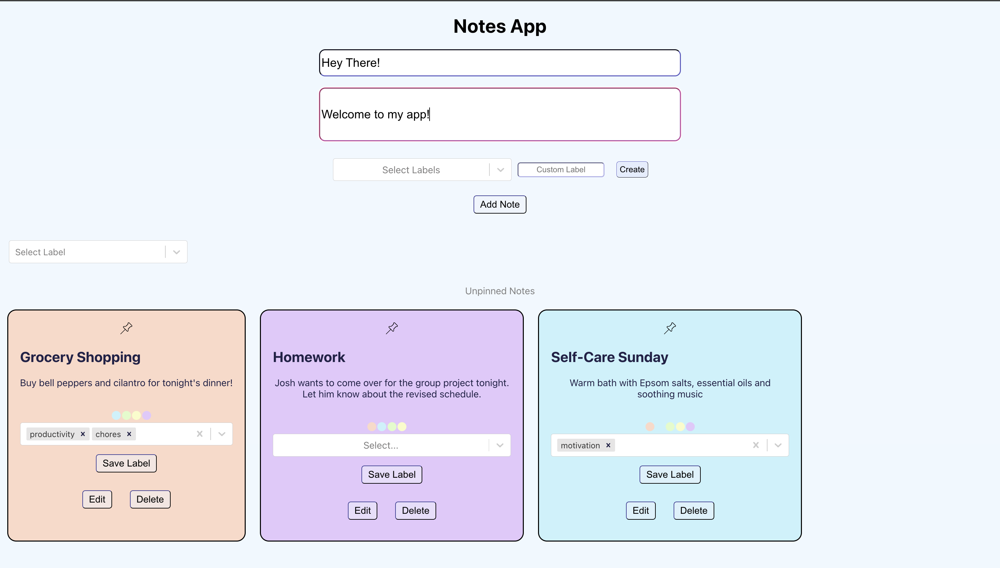
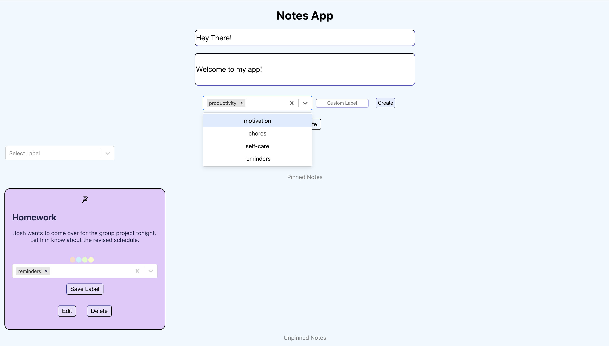
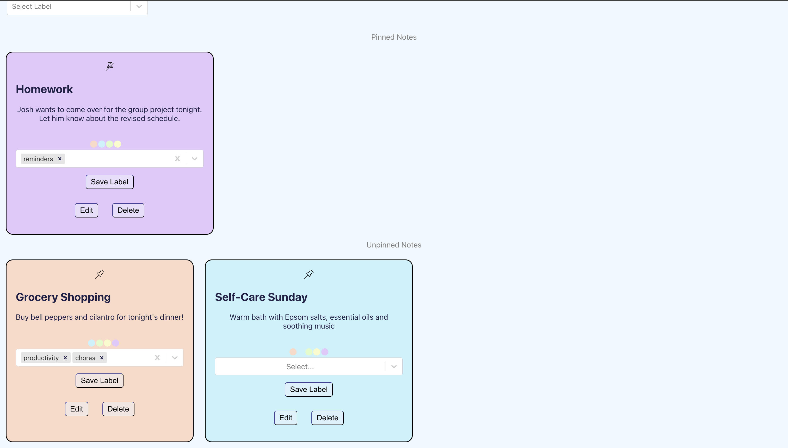
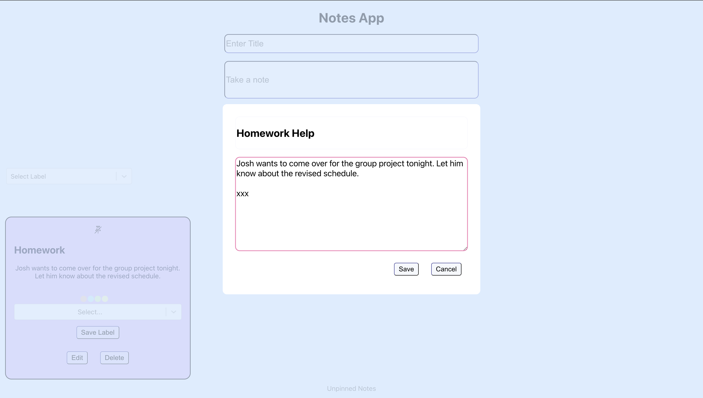

# Pretty Notes app

An intuitive, minimalist and visually appealing note-making app for seamless note-taking. ✨ 🗒️

## What It Does

Its a React Single Page Application (SPA) that provides an aesthetically elegant layout, letting you create and pin colourful sticky notes onto your browser screen.

- Users directly land on the Notes Page 📝, and can `View`, `Add`, `Edit`, or `Delete` notes, and can even `Label` up 🏷️ and `Search` 🔍 for their Notes!
- Notes can be `colour co-ordinated` and organised using labels for a productive management. 🎨
- It also offers a `Pin/Unpin` feature 📌, where your most important notes for the day can be pinned to the top, away from all the clutter.

All notes are saved on this backend server, and sorted and displayed based on the last modified date.

## Tech Stacks used

The UI is built using React ^18.2.0, and uses simple CSS for styling the screens. It connects to a hosted SpringBoot API Service (you can find it here) using the axios library, where all notes are saved, and CRUD operations are done.

## Instructions

The repo follows a simple and intuitive structure. To run the application -

1. Setup the SpringBoot service using the instructions from this repo
2. Once the backend is up and running, run the React project.
3. In the project directory, you can run: `npm start`

   - Runs the app in the development mode.
   - Open [http://localhost:3000](http://localhost:3000) to view it in your browser.
   - The page will reload when you make changes. You may also see any lint errors in the console.

## Contributions

Contributions are what make this open source community such an amazing place to learn, inspire, and create. Any contributions you make are greatly appreciated.

If you have a suggestion that would make this better, please fork the repo and create a pull request. You can also simply open an issue with the tag "enhancement". Don't forget to give the project a star! Thanks! <3

1. Fork the Project
2. Create your Feature Branch (git checkout -b feature/AmazingFeature)
3. Commit your Changes (git commit -m 'Add some AmazingFeature')
4. Push to the Branch (git push origin feature/AmazingFeature)
5. Open a Pull Request

## A glance

  

<!-- 
 -->

  
  

  

